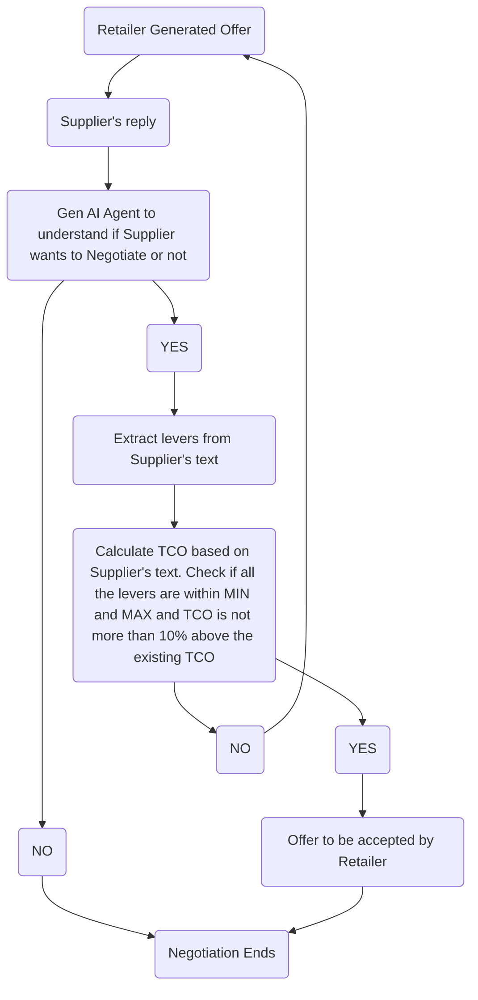

```mermaid
  graph TD;
      A(Retailer Generated Offer)-->B(Supplier's reply);
      B --> C(Gen AI Agent to understand if Supplier wants to Negotiate or not);
      C --> D(YES);
      C --> E(NO);
      D --> F(Extract levers from Supplier's text);
      E --> G(Negotiation Ends);
      F --> H(Calculate TCO based on Supplier's text. Check if all the levers are within MIN and MAX and TCO is not more than 10% above the existing TCO);
      H --> I(YES);
      H --> J(NO);
      I --> K(Offer to be accepted by Retailer);
      K --> G;
      J --> A
```